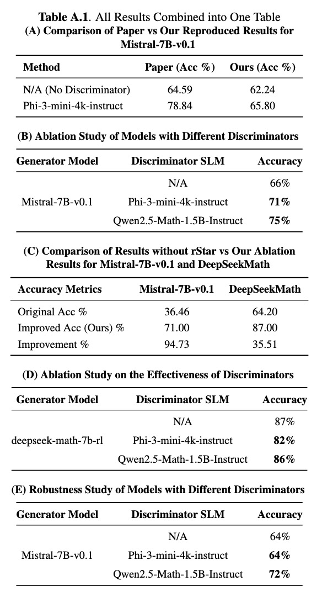

# Better reasoning with large language models

This repository contains necessary scripts to run **rStar**'s generator and discriminator.

> Link to original paper: https://huggingface.co/papers/2408.06195, https://arxiv.org/abs/2408.06195

## Intro

This repository provides an exploration of how to better leverage the reasoning capabilities in Small Language Models using the Monte Carlo Tree Search approach. Taking inspiration from rStar, we reproduce and expand on their methods, paying great attention to robust inference that balances the trade-offs between reliability and efficiency. The main contribution is to demonstrate that excluding overly complex actions, such as paraphrasing the question, can indeed simplify the approach without reducing accuracy for small language models.

We also analyze how various generator-discriminator pairs influence the overall performance. Further, we test the robustness of the framework by applying it to the modified GSM8K subset questions and show that the simplified approach holds good even when problem statements or numbers are changed. This project also discussed future work, like adaptive masking and integrated verification layers, to further improve reasoning capabilities.

## Prerequisites

- Python 3.10
- CUDA 12
- newest PyTorch
- newest `transformers`
- newest `vllm`

## Usage

### rStar Generator

Here is an example to run rStar generator:

```bash
bash scripts/run_gsm8k_generator.sh
```

The script `run_gsm8k_generator.sh` includes several configurable parameters:

- `--dataset_name`: Name of the dataset (choose from [MATH, GSM8K, GSM8KHARD, STG, SVAMP, MULTIARITH]).
- `--test_json_filename`: Filename for the test JSON (default: test_all).
- `--model_ckpt`: Path to the model checkpoint.
- `--note`: Additional note to mark the output folder. Without further arguments, the generator output folder will be `./run_outputs/<dataset_name>/<model_ckpt>/<execute_time>---[<note>]`
- `--num_rollouts`: Number of rollouts (default: 16).

Make sure to adjust these parameters according to your requirements.

#### Evaluate rStar Generator

Here is an example to evalute the results of **rStar** generator

```bash
python eval_src/do_eval.py --dataset_name GSM8K --exp_dir_path <generator_output_folder>
```

### rStar Discriminator

Here is an example to run rStar discriminator:

```bash
bash scripts/run_gsm8k_discriminator.sh
```

The script `run_gsm8k_discriminator.sh` includes several configurable parameters:

- `--model_ckpt`: checkpoint Path to the discriminator model.
- `--root_dir`: Path of evalution result folder.
- `--dataset_name`: Name of the dataset (choose from [MATH, GSM8K, GSM8KHARD, STG, SVAMP, MULTIARITH]).
- `--note`: Additional note to mark the output folder. Without further arguments, the discriminator output folder will be `<root_dir>/dis_<execute_time>---<note>`

## Results

We have run large-scale experiments with four SLMs: Phi3-mini, Mistral-7B, Qwen2.5-Math, and DeepSeek-Math-7B. We achieved significant improvements in GSM8K accuracy for Mistral-7B, increasing from 36.46% to 65.8%, using the rStar framework. Furthermore, according to the GSM8K subset presented in this work, except for action A5, its accuracy jumped to 71% for Mistral-7B and the accuracy increased from 64.2% to 87% for DeepSeek-Math-7B with only the generator running.


<p align="center">
  
</p>
